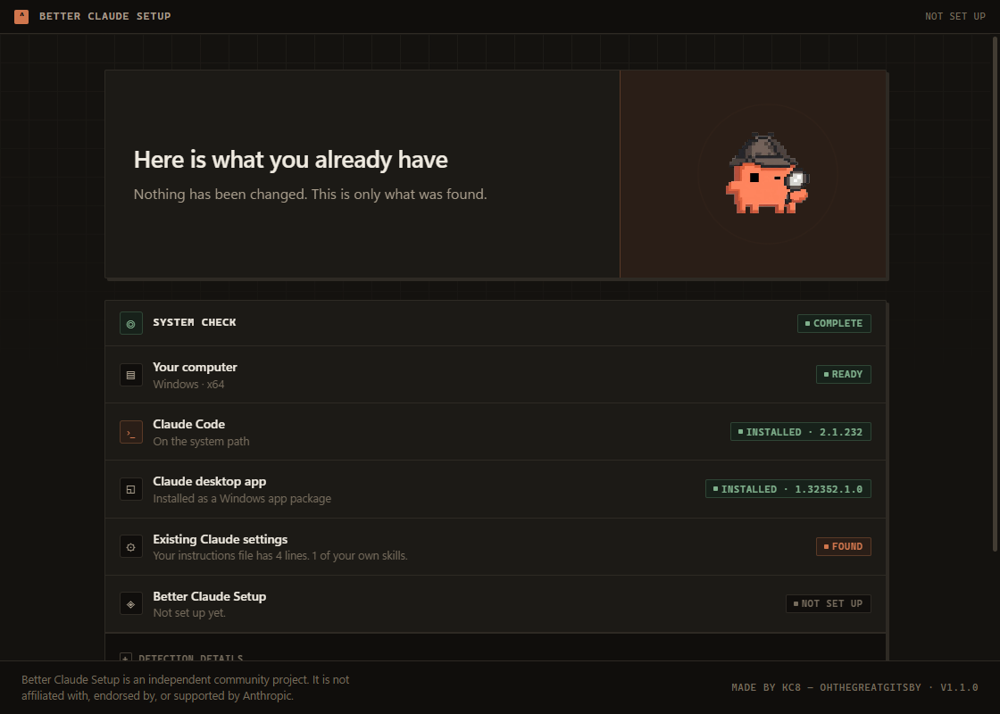
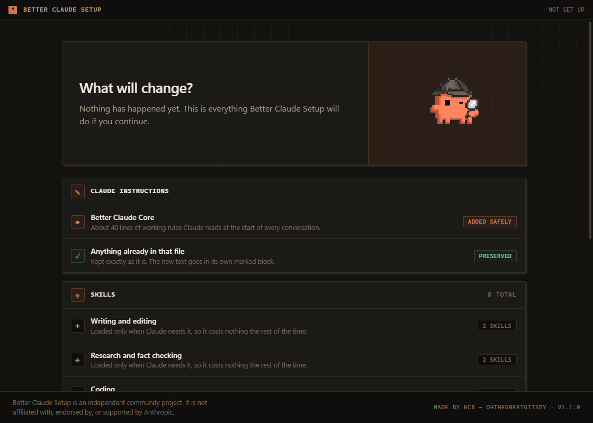
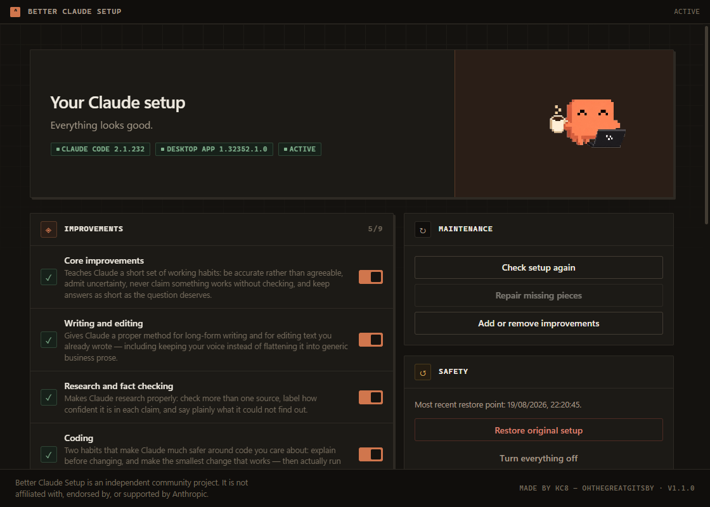
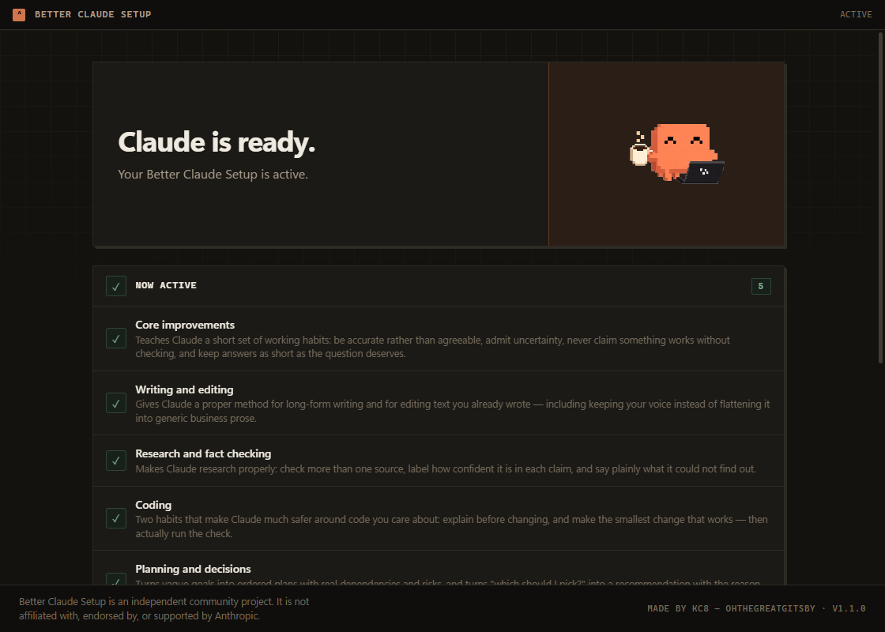

# Better Claude Setup

**Made by KC8 — OhTheGreatGitsby**

A small desktop app that configures Claude properly for you, and can undo everything it does.

> Better Claude Setup is an independent community project. It is not affiliated with,
> endorsed by, or supported by Anthropic.


| | |
| --- | --- |
|  |  |
|  |  |

---

## What this is

Claude is good out of the box and noticeably better when you tell it how you want it to
work. Doing that yourself means editing a `CLAUDE.md` file, writing skill folders, and
knowing which settings are worth changing.

Better Claude Setup writes a small, carefully chosen set of instructions and skills into
Claude's own configuration for you. It shows you every change first, saves a copy of what
you already had, and can put everything back.

**It is for you if** you use Claude, or Claude Code, and have never opened a terminal — or
you have, and simply want a sane baseline without hand-maintaining a prompt library.

## What it actually changes

Everything lands in your Claude folder (`~/.claude` on macOS and Linux,
`%USERPROFILE%\.claude` on Windows).

### Which Claude this reaches

Better Claude Setup configures **Claude Code**. The Claude desktop app reads the same
files from its **Code** tab, so local sessions there get the same setup. The rest of the
desktop app does not, because it is configured by your Anthropic account rather than by
anything on your computer.

| Surface | Configured? |
| --- | --- |
| Claude Code — terminal, VS Code, JetBrains | **Yes** |
| Claude desktop app — **Code** tab, local sessions | **Yes**, the same files |
| Claude desktop app — **Chat** tab | No — account settings and Styles |
| Claude desktop app — **Cowork** tab | No — skills sync from your claude.ai account |
| claude.ai in a browser | No |
| Cloud and SSH sessions | No — they read a different machine's home folder |

Version 1.0.0 said this app "also improves the Claude desktop app", which was too broad.
The table above is the accurate version, checked against Anthropic's documentation.

| What | Where | Always in Claude's memory? |
| --- | --- | --- |
| Core working rules | one marked block in `CLAUDE.md` | Yes — about 40 lines |
| Writing, research, coding, planning, design skills | `skills/bcs-*/SKILL.md` | No — loaded only when used |
| One optional setting | `settings.json` | Not applicable |
| Optional add-ons from Anthropic's catalogue | Claude Code's own plugin store | Only when used |

This split is deliberate. Claude has a limited working memory and everything loaded at the
start of a conversation spends some of it, so only one short block is always present.
Everything else is a *skill*, which Claude reads only when the task calls for it.

### What it does **not** change

- It never reads your conversations, projects, or documents.
- It never sends anything anywhere. There is no account, no telemetry, no analytics.
- It never alters Claude's safety behaviour or your Anthropic account.
- It never overwrites a setting you already had. If you already set a value it wants, it
  keeps yours and tells you.
- It never touches skills you installed yourself.
- It cannot change the personal instructions or Styles you set inside the Claude app, or
  anything in the Chat and Cowork tabs, because those live on your Anthropic account
  rather than on your computer. See
  [docs/research.md](docs/research.md#4-claude-desktop-and-the-claude-app).

## Install

Download the installer for your computer from the
[latest release](https://github.com/OhTheGreatGitsby/better-claude-setup/releases/latest).

### Windows

1. Download `Better-Claude-Setup-Setup-x64.exe` (or `-arm64.exe` on an ARM machine).
2. Run it. It installs for your user only and does **not** ask for administrator rights.
3. Windows SmartScreen will warn you that the publisher is unknown, because the app is not
   code-signed yet. Choose **More info → Run anyway** if you are comfortable doing so, or
   [build it yourself](#build-it-yourself). See [Limitations](#limitations).

### macOS

1. Download `Better-Claude-Setup-arm64.dmg` (Apple Silicon) or `-x64.dmg` (Intel).
2. Open it and drag the app to Applications.
3. The app is not notarised yet, so macOS will refuse to open it on the first try.
   Right-click the app → **Open** → **Open**, or run
   `xattr -dr com.apple.quarantine "/Applications/Better Claude Setup.app"`.

Both warnings are honest signals: they mean nobody has paid for a signing certificate.
They will go away once signing is in place. Until then, building from source gives you the
same app with no warning.

## Using it

1. **Welcome** — a plain-language explanation of what will happen.
2. **System scan** — read-only, and it shows its working. Each check appears as it
   actually finishes, and **Detection details** lists every route it tried to find Claude
   Code and the desktop app, so a wrong answer can be diagnosed rather than guessed at.
3. **Claude Code** — if Claude Code is missing, it offers to install it via WinGet or
   Homebrew and shows you the exact command first. You can skip this.
4. **Choose** — take the recommended set, or turn each part on and off yourself.
5. **What will change?** — the complete list of writes, before any of them happen.
6. **Setting up** — live progress. Each row changes when the real operation finishes;
   nothing is on a timer.
7. **Done** — what is now active, with the full step log behind a toggle.

Reopen the app at any time and it becomes a manager: what is enabled, what is not, remove
individual parts, or restore everything.

After setup, restart Claude Code or start a new conversation so it re-reads the
instructions. Type `/` to see the new skills.

## Undoing it

Three levels, all in the app:

- **Remove one component** — deletes only that component's files or block. Your own
  content in the same file is untouched.
- **Disable all Better Claude defaults** — removes everything this app installed, and
  nothing else.
- **Restore original configuration** — puts `CLAUDE.md`, `settings.json` and the `skills`
  folder back exactly as they were before the first change, from the copy saved at that
  moment.

Restore points live in `<your Claude folder>/better-claude-setup/backups/` as ordinary
files. You can inspect or restore them by hand without this app.

To uninstall the app itself: Windows — *Settings → Apps → Better Claude Setup*; macOS —
drag it to the Trash. Uninstalling the app leaves your Claude configuration alone, so
remove or restore your components first if that is what you want.

## Privacy

Better Claude Setup does not need your personal data and does not collect any.

- No telemetry, no analytics, no crash reporting, no update pings.
- No account, no login.
- The only network activity in the whole app is optional: installing Claude Code through
  WinGet or Homebrew, and installing an add-on from Anthropic's official plugin catalogue.
  Both are off unless you choose them.
- The renderer process is blocked from making network requests at all.
- The local log records what the app did, never what you or Claude wrote. Home directory
  paths, your username, email addresses, IP addresses and anything that looks like a key
  or token are stripped before anything is written to disk.
- **Export Diagnostic Report** produces a scrubbed report you can paste into a bug report.
  Read it before you send it; you will see exactly what it contains.

## What gets installed

| Component | Category | Default | What it does |
| --- | --- | --- | --- |
| Core improvements | Core | On | Accuracy over agreement, stated uncertainty, no claiming untested work, brevity by default |
| Writing and editing | Writing | On | `/bcs-essay`, `/bcs-rewrite` |
| Research and fact checking | Research | On | `/bcs-deep-research`, `/bcs-fact-check` |
| Coding | Coding | On | `/bcs-explain-code`, `/bcs-safe-change` |
| Planning and decisions | Planning | On | `/bcs-plan`, `/bcs-decide` |
| Design and ideas | Design | Off | `/bcs-design-critique`, `/bcs-brainstorm` |
| Always think before answering | Core | Off | Sets `alwaysThinkingEnabled` |
| Automatic security review | Extras | Off | Anthropic's `security-guidance` plugin |
| Git commit helpers | Extras | Off | Anthropic's `commit-commands` plugin |

Every skill is plain Markdown in this repository — read them in
[`src/main/core/content.ts`](src/main/core/content.ts). No component grants Claude any
tool permission it did not already have.

## Build it yourself

Requires [Node.js](https://nodejs.org) 20.19 or newer.

```bash
git clone https://github.com/OhTheGreatGitsby/better-claude-setup.git
cd better-claude-setup
npm ci
npm test          # run the test suite
npm run dev       # run the app in development
npm run dist:win  # build a Windows installer into release/
npm run dist:mac  # build a macOS disk image into release/ (must run on macOS)
```

See [docs/architecture.md](docs/architecture.md) for how it is put together and
[docs/security.md](docs/security.md) for the security model.

## Reporting a problem

Open an issue at
[github.com/OhTheGreatGitsby/better-claude-setup/issues](https://github.com/OhTheGreatGitsby/better-claude-setup/issues).
Attach the diagnostic report from the app if the problem is about detection or
installation — it is already scrubbed of personal information.

For anything security-related, please read [SECURITY.md](SECURITY.md) first.

## Limitations

Stated plainly, because an installer that overstates itself should not be trusted:

- **Windows builds are not code-signed** and **macOS builds are not notarised.** Both need
  paid certificates that this project does not have. The release pipeline is otherwise
  complete; signing is a configuration step, not a rewrite.
- **macOS builds have not been run on a Mac by the maintainer.** They are produced by CI on
  a macOS runner and the build succeeds, but the app has not been launched there. macOS
  desktop-app detection is implemented and unit-tested against fixtures, but has not been
  confirmed against a real macOS installation.
- The app cannot configure the Chat or Cowork tabs, or the personal instructions and Styles
  inside the Claude app, because those are account settings held by Anthropic rather than
  files on your machine.
- Version pinning is not possible for the two optional Anthropic plugins: Claude Code owns
  that resolution and always installs the current marketplace version.

## Licence

MIT — see [LICENSE](LICENSE).
