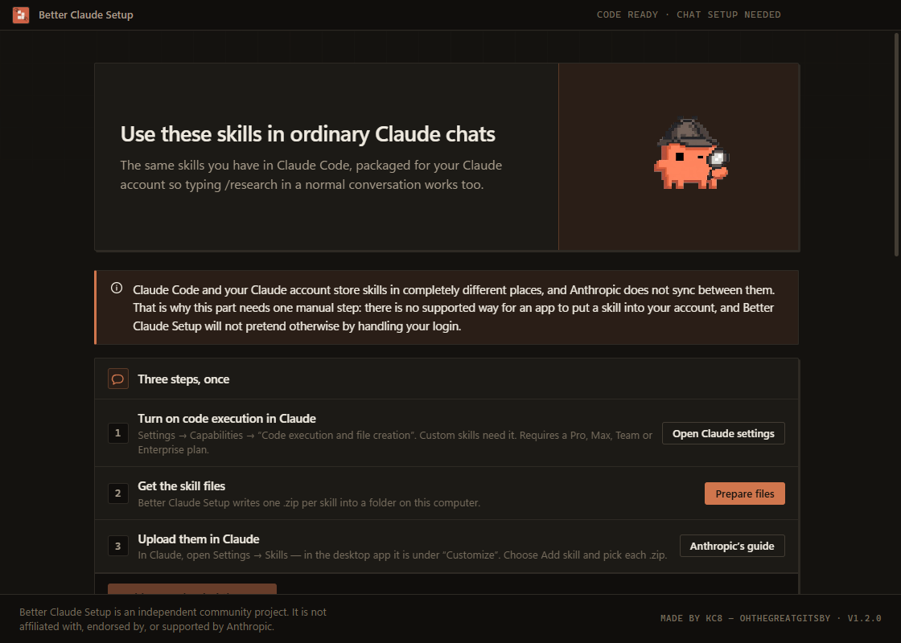

# Better Claude Setup

**Make Claude noticeably better — without touching a terminal.**

A small desktop app that sets up Claude Code for you, packages the same skills for ordinary
Claude chats, shows every change before it makes it, and can undo all of it.

> An independent community project. Not affiliated with, endorsed by, or supported by Anthropic.

---

## Download

### Windows

| | |
| --- | --- |
| **[Windows x64 — recommended](https://github.com/OhTheGreatGitsby/better-claude-setup/releases/latest/download/Better-Claude-Setup-Setup-x64.exe)** | Almost every PC |
| [Windows ARM64](https://github.com/OhTheGreatGitsby/better-claude-setup/releases/latest/download/Better-Claude-Setup-Setup-arm64.exe) | Snapdragon / ARM laptops |

Installs for your user only. No administrator rights. Windows will warn that the publisher
is unknown, because the app is not code-signed — choose **More info → Run anyway**.

### macOS — unsigned preview

| | |
| --- | --- |
| [Apple Silicon (M1–M4)](https://github.com/OhTheGreatGitsby/better-claude-setup/releases/latest/download/Better-Claude-Setup-arm64.dmg) | **unsigned preview** |
| [Intel Mac](https://github.com/OhTheGreatGitsby/better-claude-setup/releases/latest/download/Better-Claude-Setup-x64.dmg) | **unsigned preview** |

**Read this before downloading on a Mac.** These builds are ad-hoc signed but **not
notarised**, because notarisation requires a paid Apple Developer account this project does
not have. macOS will refuse to open them on the first attempt. After moving the app to
Applications, clear the download quarantine flag once:

```bash
xattr -dr com.apple.quarantine "/Applications/Better Claude Setup.app"
```

That command removes the "downloaded from the internet" marker from this one app. It does
**not** disable Gatekeeper or weaken macOS security in any way, and nothing here will ever
ask you to do that.

[All releases and checksums →](https://github.com/OhTheGreatGitsby/better-claude-setup/releases/latest)

---


## What it does

Claude is good out of the box and noticeably better when you tell it how you want to work.
Doing that yourself means editing a `CLAUDE.md` file, writing skill folders, and knowing
which settings are worth changing.

Better Claude Setup does it for you, in two places.

### 1. Claude Code, automatically

A short set of working rules plus ten skills, written into Claude's own settings folder:

| Command | What it does |
| --- | --- |
| `/research` | Researches properly: multiple sources, primary over secondary, evidence separated from interpretation, confidence marked per claim |
| `/fact-check` | Checks each claim separately and says which hold up |
| `/write` | Long-form writing that argues rather than surveys |
| `/rewrite` | Edits without flattening your voice |
| `/plan-work` | Ordered plans with real dependencies and risks |
| `/decide` | Reaches a recommendation, and names what would change it |
| `/brainstorm` | Genuinely different ideas, not ten variations of one |
| `/design-review` | Specific fixes, not generic advice |
| `/explain-code` | Plain-language explanations at your level |
| `/safe-change` | Minimal, verified code changes |

### 2. Ordinary Claude chats, with one manual step

The same skills, packaged as Claude account skills. Once uploaded, typing `/research …` in a
normal Claude conversation runs the same workflow.

The app builds the upload files and walks you through it. It cannot do the upload for you:
Anthropic publishes no API for adding a skill to a personal Claude account, and this app
will not handle your login to fake one.

## Which Claude this reaches

| Surface | Supported | How |
| --- | --- | --- |
| Claude Code — terminal | **Yes** | Automatic |
| Claude Code — VS Code / JetBrains | **Yes** | Automatic |
| Claude desktop app — **Code** tab | **Yes** | Reads the same local files |
| Claude desktop app — **Chat** tab | **Yes** | Account skills, one-time upload |
| Claude on the web | **Yes** | Account skills, one-time upload |
| Cowork | **Yes** | Loads the skills enabled on your account |
| Claude mobile | Untested | Account skills may apply; not verified |
| Claude API | No | API skills are a separate upload this app does not manage |

Account skills need **code execution** turned on, and a **Pro, Max, Team or Enterprise**
plan. Anthropic's platform documentation lists those plans; one help-centre page also lists
Free, so treat Free as unconfirmed.

Claude Code skills and Claude account skills are **separate systems that do not sync** —
that is Anthropic's design, and it is why this app handles them as two surfaces.

## How setup works

1. **Scan** — read-only. Reports what you already have, and shows every detection route it
   tried under **Detection details**.
2. **Choose** — recommended, or pick each part yourself.
3. **What will change?** — the complete list, before anything happens.
4. **Install** — live progress tied to real operations, never a timer.
5. **Claude Chat** — optional, guided, one-time.

## Safety

- A **restore point** is saved before the first change.
- Every change is **shown first**.
- Anything it installs, it knows how to remove — **exactly**, without touching your own files.
- Your existing `CLAUDE.md` content, settings keys and skills are preserved. If you already
  set a value it wants, yours wins and it says so.

Three levels of undo: remove one component, turn everything off, or restore the original
configuration. Restore points are ordinary folders you can inspect by hand.

## Privacy

No telemetry, no analytics, no account, no login. The interface is blocked from making
network requests at all. The only network use is optional: installing Claude Code through
WinGet or Homebrew, and installing an add-on from Anthropic's own catalogue.

Logs and the diagnostic report are stripped of home paths, your username, email addresses,
IP addresses and anything key-shaped before being written.

## Screenshots

| | |
| --- | --- |
|  |  |
|  |  |

## Build from source

Requires [Node.js](https://nodejs.org) 20.19 or newer.

```bash
git clone https://github.com/OhTheGreatGitsby/better-claude-setup.git
cd better-claude-setup
npm ci
npm test          # engine tests
npm run test:ui   # interface tests (builds first)
npm run dev       # run the app
npm run dist:win  # Windows installer into release/
npm run dist:mac  # macOS disk image into release/ (must run on macOS)
```

- [Architecture](docs/architecture.md) — how it is put together and why
- [Security model](docs/security.md) — threat model and what is enforced
- [Research](docs/research.md) — what was verified against Anthropic's docs, and when

## Limitations

- **Windows builds are not code-signed** and **macOS builds are not notarised.** Both need
  paid certificates. The macOS build is ad-hoc signed, which is the most an unsigned
  pipeline can do; without notarisation macOS still requires the quarantine step above.
- **The macOS build has not been run on a physical Mac by the maintainer.** CI verifies the
  package on a real macOS arm64 runner — signature, structure, architecture, Gatekeeper
  verdict, a quarantined copy, and that the process actually starts — but that is not the
  same as your Mac.
- macOS desktop-app **detection** is implemented and tested against fixtures, not against a
  real macOS Claude installation.
- Account skills cannot be verified by this app. When it says Claude Chat is ready, that is
  **your confirmation**, recorded — never a detection.
- The two optional Anthropic plugins cannot be version-pinned; Claude Code owns that.

## Licence

MIT — see [LICENSE](LICENSE).
